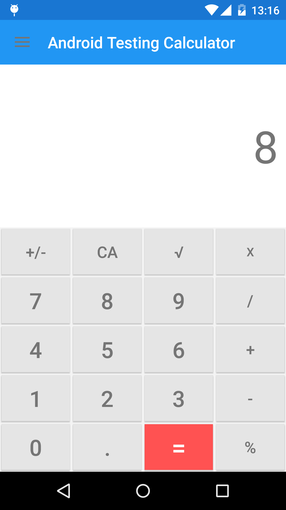

# AndroidTestingCalculator
Simple calculator for android created for educational purposes on testing in android

This is a calculator with limitations, it is created for educational purposes. The logic of the calculator may not be the most appropriate if your goal was to make a real calculator.




## Unit test configuration
From version 1.1 of Android Studio and the Android gradle plugin brings support for unit testing.

* Add Dependencies in the build.gradle file of your android module
```groovy
dependencies {
    //Tests
    testCompile 'junit:junit:4.12'
    testCompile 'org.mockito:mockito-core:1.10.19'
}
```
* Update build.gradle to use the android gradle plugin version 1.1 or later
```groovy
buildscript {
    repositories {
        jcenter()
    }
    dependencies {
        classpath 'com.android.tools.build:gradle:1.2.3'
    }
}

allprojects {
    repositories {
        jcenter()
    }
}  
```
* Create a directory for your testing source code, src/test/java
* Open the "Build variants" tool window and change the test artifact to "Unit tests".
* Create your test!!!

* The android.jar file that is used to run unit tests does not contain any actual code. Instead, all methods throw exceptions (by default). This behavior is to make sure your unit tests only test your code and do not depend on any particular behaviour of the Android platform. If that proves problematic, you can add the snippet below to your build.gradle to change this behavior:

```groovy
android {
  // ...
  testOptions { 
    unitTests.returnDefaultValues = true //Caution!
  }
}
```
## Android UI test configuration
UI test run on the device and requires two configurations:
* Instrumentation Test configuration
* Automation Framework Test configuration . This project will use two : Espresso and Robotium

###Instrumentation Test Configuration
The AndroidJUnitRunner is a new unbundled test runner for Android, which is part of the Android Support Test Library and can be downloaded via the Android Support Repository. The new runner contains all improvements of GoogleInstrumentationTestRunner and adds more features:

1. JUnit4 support
2. Instrumentation Registry for accessing Instrumentation, Context and Bundle Arguments
3. Test Filters @SdkSupress and @RequiresDevice
4. Test timeouts
5. Sharding of tests
6. RunListener support to hook into the test run lifecycle
7. Activity monitoring mechanism ActivityLifecycleMonitorRegistry

* Download last Android Support Repository


* Add dependencies to app module build.gradle and new AndroidJUnitRunner
```groovy
apply plugin: 'com.android.application'

android {
    ...
    defaultConfig {
        …
        testInstrumentationRunner ‘android.support.test.runner.AndroidJUnitRunner’
    }

}
dependencies {
    // Instrumentation Tests
   androidTestCompile 'com.android.support.test:runner:0.3'
   androidTestCompile 'com.android.support.test:rules:0.3'
}
```
* Verify directory for your testing source code, src/androidTest/java
* Open the "Build variants" tool window and change the test artifact to "Android Intrumentation Tests".

### Espresso Configuration

* Add dependencies to app module build.gradle 
```groovy
apply plugin: 'com.android.application'

android {
    ...
    defaultConfig {
        …
        testInstrumentationRunner ‘android.support.test.runner.AndroidJUnitRunner’
    }

}
dependencies {
    // Instrumentation Tests
   androidTestCompile 'com.android.support.test:runner:0.3'
   androidTestCompile 'com.android.support.test:rules:0.3'
   
   //Espresso
   androidTestCompile 'com.android.support.test.espresso:espresso-core:2.2'
   androidTestCompile 'com.android.support.test.espresso:espresso-contrib:2.2'
}

```
License
-------

    Copyright 2015 Jorge Sánchez Fernández

    Licensed under the Apache License, Version 2.0 (the "License");
    you may not use this file except in compliance with the License.
    You may obtain a copy of the License at

       http://www.apache.org/licenses/LICENSE-2.0

    Unless required by applicable law or agreed to in writing, software
    distributed under the License is distributed on an "AS IS" BASIS,
    WITHOUT WARRANTIES OR CONDITIONS OF ANY KIND, either express or implied.
    See the License for the specific language governing permissions and
    limitations under the License.
